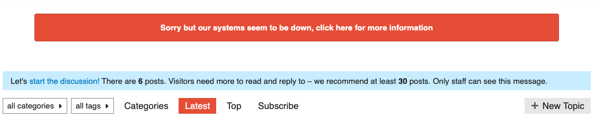
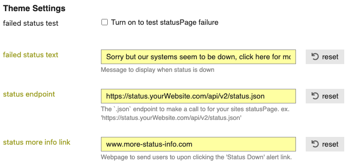

# discourse-statuspage
This theme-component will ping your Atlassian Status Page `.json` endpoint and alert forum users when system(s) are down.

To use, just add the `.json` endpoint for your system into the `status endpoint` textbox in the component settings. When a system is down, your custom message will appear at the top of the forum.

### Custom Settings
- Ability to turn on the error message to test out the look + feel.
- Customize failure message + link to take users to on click of error message

