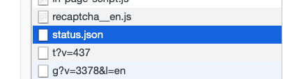

# discourse-atlassian-statuspage
This theme-component will ping your **Public Facing** Atlassian Status Page's `.json` endpoint and alert forum users when system(s) are down.

To use, just add the `.json` endpoint for your system into the `status endpoint` textbox in the component settings. When a system is down, your custom message will appear at the top of the forum.

## How can I find my public facing Status Page endpoint?
1) Visit your websites stauts page in a web browser.
2) Open the network inspector and refresh the page.
3) Look for `status.json` in the list of requests being made and **hover over it**, it should give you the `.json` endpoint.

## Custom Settings
- Ability to turn on the error message to test out the look + feel.
- Customize failure message + link to take users to on click of error message

